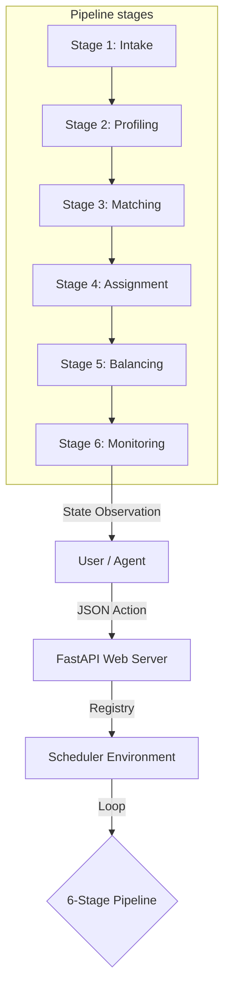

# 🚀 Dynamic Cluster Scheduling with Reinforcement Learning

> **An OpenEnv-compliant, high-fidelity simulation for autonomous resource orchestration.**

[](https://github.com/meta-llama/openenv)
[](https://stable-baselines3.readthedocs.io/)
[](https://fastapi.tiangolo.com/)

---

## 🎯 1. Project Overview & Goal

The **Reinforcement Learning-based Cluster Scheduler** is a professional-grade environment designed to solve one of the most complex problems in cloud computing: **Optimal Resource Allocation.**

### The Problem
Traditional schedulers (Kubernetes, Slurm) rely on static heuristics like "First-Fit" or "Round-Robin." While reliable, these methods are "short-sighted"—they don't learn from cluster history and often lead to **Resource Fragmentation**, where small pockets of CPU/GPU are wasted because they are scattered across different nodes.

### Our Solution
This project transforms cluster scheduling into a **Sequential Markov Decision Process (MDP)**. By breaking down the scheduling lifecycle into a strict 6-stage pipeline, we allow Deep Reinforcement Learning agents (like DQN) to learn the "geometry" of resource demand, resulting in significantly higher cluster pack-densities and lower task rejection rates.

---

## 🏗️ 2. System Architecture

The project follows the **OpenEnv standardized architecture**, ensuring separate concerns between the core environment logic, the data models, and the communication layer.



---

## 🔄 3. The 6-Stage Pipeline Logic

To mirror professional orchestrators (like Kubernetes), scheduling is not a single "jump." It is a sequence of stages that the agent must navigate:

| Stage | Name | Data Responsibility | Reward Impact |
| :--- | :--- | :--- | :--- |
| **1** | **Intake** | Selects task difficulty (Easy/Med/Hard) and sets priority. | Demand Reward |
| **2** | **Profiling** | Gathers telemetry on CPU, Memory, and GPU across 10 nodes. | Health Reward |
| **3** | **Matching** | Filters out nodes that physically cannot fit the task. | Eligibility Reward |
| **4** | **Assignment** | **The RL Choice:** The agent selects the target `node_id`. | Fit Quality Reward |
| **5** | **Balancing** | Analyzes cluster-wide variance (Standard Deviation). | Variance Reward |
| **6** | **Monitoring** | Finalizes placement and computes the **Total Reward**. | Success Reward |

---

## 🏆 4. The Reward Formula (The Math)

The environment uses a multi-factor **Fractional Reward System**. Instead of just "success or failure," the agent receives granular feedback at every stage to accelerate learning.

$$ Reward = 0.40 \times U + 0.30 \times B + 0.30 \times F - P $$

*   **U (Utilization)**: Percentage of consumed cluster resources ($ \frac{\text{Used}}{\text{Total}} $).
*   **B (Balance)**: Reward for low variance ($ 1 - (\sigma^2 \times 20) $).
*   **F (Fit Quality)**: Reward for "tight packing" specifically on the chosen node.
*   **P (Penalty)**: A heavy **-0.3** penalty if the agent attempts to place a task on a node that lacks resources.

---

## 🎮 5. How to use the Interactive Web UI

This project features a vibrant, modern web interface. You can manually play the role of the scheduler to understand the constraints.

### Steps to give input:

> [!IMPORTANT]
> **Input Range:** The **Stage Id** must be a number from **`1`** to **`6`**. 
> *   **1 - Intake**: Task generation/loading.
> *   **2 - Profiling**: Scanning cluster telemetry.
> *   **3 - Matching**: Finding eligible nodes.
> *   **4 - Assignment**: Placing task on the target node.
> *   **5 - Balancing**: Equalizing cluster-wide loads.
> *   **6 - Monitoring**: Finalizing rewards & success state.

1.  **Reset**: Click the **Reset** button to initialize a fresh 10-node cluster (pre-loaded at 70% capacity).
2.  **Stage Selector**: Enter a number **`1`** through **`6`** in the **Stage Id** box.
3.  **Step**: 
    - At `Stage 1`, the system generates a new task.
    - At `Stage 4`, the system automatically uses a **Best-Fit algorithm** to handle the placement based on your current state.
4.  **Observation**: Watch the **Visible Cluster State** JSON update in real-time. It shows the free percentage of every node.
5.  **Score**: At `Stage 6`, your **Total Reward** (0.0 to 1.0) will appear at the top of the UI.

---

## 🤖 6. How Automated Inference Works

The `inference.py` script runs a rigorous **18-step benchmark** cycle across 3 tasks.

1.  **Task 1 (Easy)**: Steps 1-6. Agent learns basic placement.
2.  **Task 2 (Medium)**: Steps 7-12. Agent manages moderate load.
3.  **Task 3 (Hard)**: Steps 13-18. Agent must find the final remaining "holes" in the cluster resources.

**To run the check:**
```bash
uv run python inference.py
```
It will output a high-visibility summary at the end of every task, showing the agent's progress, its reward, and whether it successfully balanced the cluster.

---

## 🌟 7. Advantages of this Approach

1.  **Explainable AI**: Because of the 6-stage pipeline, you can see *exactly* at which stage an agent is failing (e.g., does it fail at Matching or Assignment?).
2.  **Resource Multi-dimensionality**: Unlike simple simulators, we track **CPU, RAM, and GPU** independently. An agent might find a node with enough CPU but fail because it forgot to check GPU capacity.
3.  **Horizontal Scalability**: The state vector is flattened, allowing the same agent to potentially scale to larger clusters by simply shifting the input window.
4.  **Production Ready**: Built on **FastAPI** and **Docker**, this environment can be deployed as a microservice in an actual cloud lab.

---

## 👁️ 8. Detailed Observation Mapping

The environment returns a complex observation object. Below is the mapping for the **35-element State Vector** and the human-readable metadata.

### 📊 State Vector Index Mapping (Indices 0-34)

| Index Range | Category | Description | Typical Value |
| :--- | :--- | :--- | :--- |
| **0 - 29** | **Cluster Nodes** | 10 nodes × 3 resources (CPU, Mem, GPU availability %). | `0.3` (30% free) |
| **30 - 32** | **Task Demand** | The specific CPU, Mem, and GPU units required by the active task. | `12.0` (Medium) |
| **33** | **Stage ID** | The current 1-indexed stage of the pipeline (intake to monitoring). | `1.0` to `6.0` |
| **34** | **Queue Len** | Number of tasks remaining in the multi-task episode. | `3.0` to `1.0` |

### 🧩 Metadata Structure (`info`)

The `info` dictionary (also aliased as `metadata`) provides a human-readable snapshot of the cluster, allowing for easy debugging without decoding the state vector.

```json
{
  "readable_cluster_state_free_pct": {
    "Node 0": [0.3, 0.3, 0.3],
    "Node 1": [0.3, 0.3, 0.3],
    "...": "...",
    "Node 9": [0.3, 0.3, 0.3]
  }
}
```

---

## 📂 9. Project Layout

```bash
.
├── scheduler/               
│   ├── agent.py             # DQN Agent (PyTorch)
│   ├── models.py            # Pydantic Data Models (Action/Observation)
│   └── server/              
│       ├── app.py           # FastAPI Entrypoint
│       └── scheduler_env.py # Environment Core Logic
├── inference.py             # High-speed benchmarking script
└── Dockerfile               # HF Spaces Deployment Config
```
